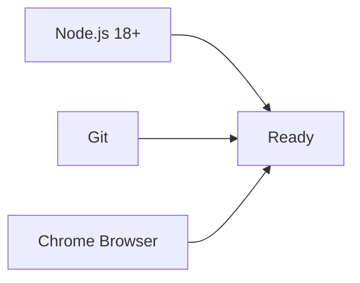
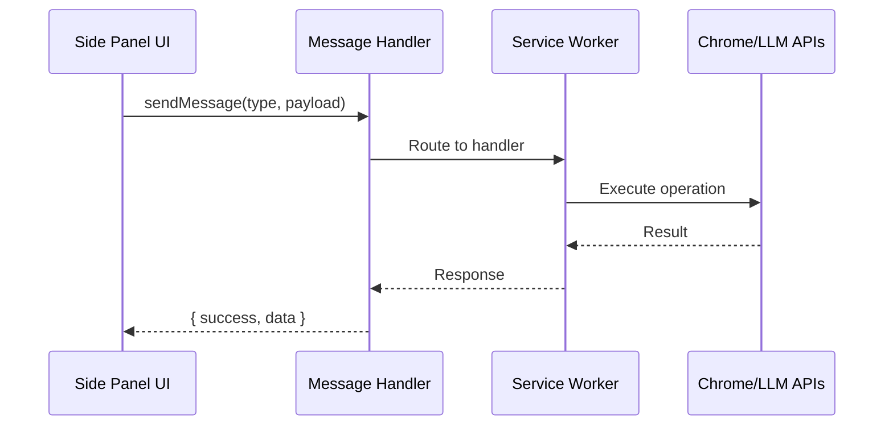
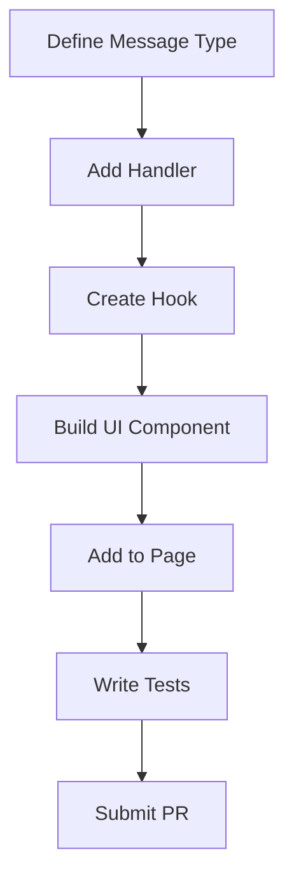
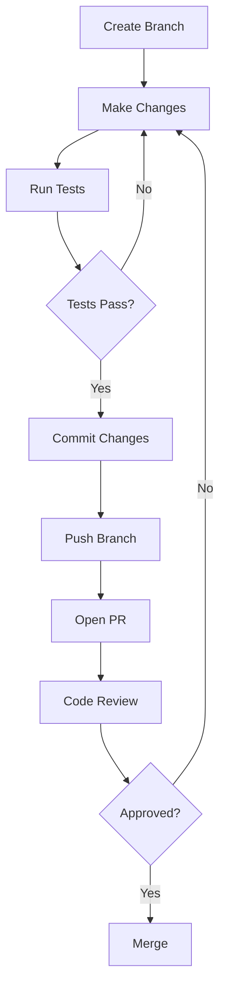
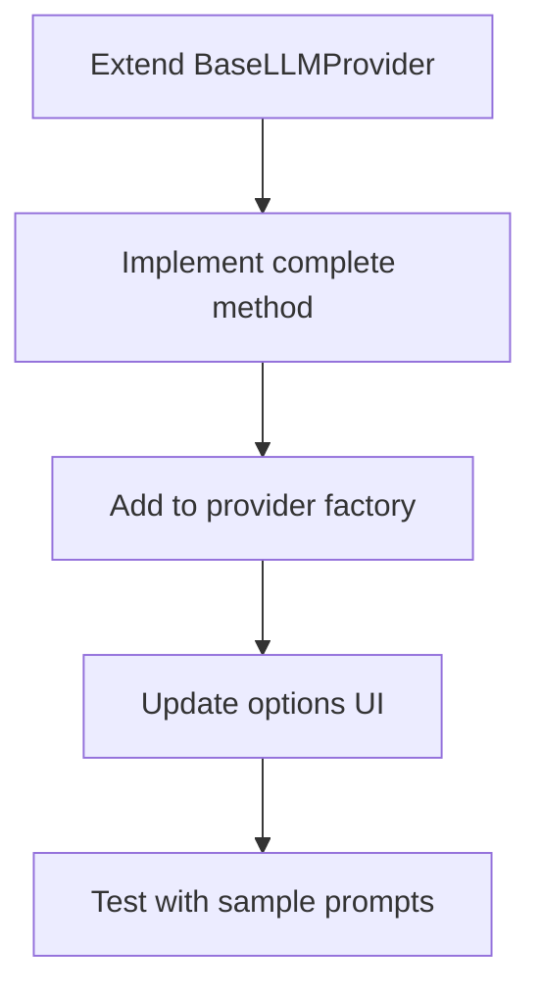

# Contributing to TabBrain

Thank you for your interest in contributing to TabBrain! This guide will help you get started.

## Development Environment Setup

### Prerequisites



### Step-by-Step Setup

```bash
# 1. Fork and clone the repository
git clone https://github.com/YOUR_USERNAME/tabbrain.git
cd tabbrain

# 2. Install dependencies
npm install

# 3. Start development server
npm run dev

# 4. Load extension in Chrome
# - Open chrome://extensions
# - Enable Developer mode
# - Click "Load unpacked"
# - Select the dist/ folder
```

## Project Architecture

### Message Flow



### Adding a New Feature



#### 1. Define Message Type

```typescript
// src/background/message-handler.ts
export type MessageType =
  | 'EXISTING_TYPES'
  | 'YOUR_NEW_TYPE'  // Add here
```

#### 2. Add Handler

```typescript
// src/background/message-handler.ts
const handlers = {
  YOUR_NEW_TYPE: async (payload: YourPayloadType) => {
    // Implementation
    return result
  },
}
```

#### 3. Create React Hook

```typescript
// src/sidepanel/hooks/useYourFeature.ts
export function useYourFeature() {
  const [data, setData] = useState(null)
  const [loading, setLoading] = useState(false)

  const execute = useCallback(async () => {
    setLoading(true)
    const response = await sendMessage('YOUR_NEW_TYPE', payload)
    setData(response.data)
    setLoading(false)
  }, [])

  return { data, loading, execute }
}
```

#### 4. Build UI Component

```typescript
// src/sidepanel/pages/YourFeature.tsx
export function YourFeature({ onBack }: Props) {
  const { data, loading, execute } = useYourFeature()

  return (
    <div>
      {/* Your UI */}
    </div>
  )
}
```

## Code Style

### TypeScript Guidelines

```typescript
// ✅ Good: Explicit types
function processTab(tab: TabInfo): ProcessedTab {
  return { ...tab, processed: true }
}

// ❌ Bad: Implicit any
function processTab(tab) {
  return { ...tab, processed: true }
}
```

### React Guidelines

```typescript
// ✅ Good: Functional components with hooks
function TabList({ tabs }: TabListProps) {
  const [selected, setSelected] = useState<Set<number>>(new Set())
  return <div>{/* ... */}</div>
}

// ❌ Bad: Class components
class TabList extends Component {
  state = { selected: new Set() }
  render() { return <div>{/* ... */}</div> }
}
```

### File Organization

```
src/
├── background/           # Service worker only
├── sidepanel/
│   ├── pages/           # One file per route
│   ├── components/      # Reusable UI components
│   └── hooks/           # Custom React hooks
├── lib/
│   ├── chrome/          # Chrome API wrappers
│   ├── llm/             # LLM-related code
│   └── algorithms/      # Pure functions
└── types/               # Shared TypeScript types
```

## Testing

### Unit Tests

```bash
# Run all unit tests
npm run test

# Run in watch mode
npm run test:watch

# Run specific test file
npm run test -- url-normalizer
```

#### Writing Unit Tests

```typescript
// tests/unit/your-feature.test.ts
import { describe, it, expect } from 'vitest'
import { yourFunction } from '../../src/lib/your-module'

describe('yourFunction', () => {
  it('should handle normal input', () => {
    expect(yourFunction('input')).toBe('expected')
  })

  it('should handle edge cases', () => {
    expect(yourFunction('')).toBe('')
    expect(yourFunction(null)).toBeNull()
  })
})
```

### E2E Tests

```bash
# Run E2E tests
npm run test:e2e

# Run with UI
npm run test:e2e:ui
```

#### Writing E2E Tests

```typescript
// tests/e2e/your-feature.spec.ts
import { test, expect } from '@playwright/test'

test('your feature works', async ({ context }) => {
  const page = await context.newPage()
  await page.goto('https://example.com')

  // Test extension behavior
  expect(await page.title()).toBe('Example')
})
```

## Pull Request Process



### Commit Messages

Use conventional commits:

```bash
# Features
git commit -m "feat: add bookmark export functionality"

# Bug fixes
git commit -m "fix: handle empty URL in normalizer"

# Refactoring
git commit -m "refactor: simplify tab grouping logic"

# Documentation
git commit -m "docs: update API configuration guide"

# Tests
git commit -m "test: add unit tests for similarity module"
```

### PR Checklist

- [ ] Code follows project style guidelines
- [ ] All existing tests pass
- [ ] New tests added for new functionality
- [ ] TypeScript compiles without errors
- [ ] Build succeeds (`npm run build`)
- [ ] Documentation updated if needed

## LLM Integration

### Adding a New Provider



```typescript
// src/lib/llm/your-provider.ts
import { BaseLLMProvider } from './provider'
import type { LLMRequestOptions, LLMResponse } from './types'

export class YourProvider extends BaseLLMProvider {
  readonly name = 'your-provider'

  async complete(options: LLMRequestOptions): Promise<LLMResponse> {
    // Your implementation
  }
}
```

### Prompt Engineering

For small models (8B-70B parameters):

```typescript
// ✅ Good: Simple, explicit instructions
const prompt = `Categorize this tab into ONE category.
Categories: Technology, Shopping, News, Entertainment, Other

Tab: "${title}" | ${url}

Respond with the category name only:`

// ❌ Bad: Complex reasoning requests
const prompt = `Analyze this tab and explain why it belongs
to a particular category, considering the URL structure,
title semantics, and potential user intent...`
```

## Chrome API Guidelines

### Permissions

Only request permissions when needed:

```typescript
// ✅ Good: Request on demand
const granted = await chrome.permissions.request({
  permissions: ['tabs'],
})

// ❌ Bad: Request everything upfront in manifest
```

### Error Handling

Always handle Chrome API errors:

```typescript
// ✅ Good: Handle errors
try {
  const tabs = await chrome.tabs.query({})
  return tabs
} catch (error) {
  logger.error('Failed to query tabs', error)
  return []
}

// ❌ Bad: Assume success
const tabs = await chrome.tabs.query({})
return tabs
```

## Getting Help

- **Issues**: Open a GitHub issue for bugs or feature requests
- **Discussions**: Use GitHub Discussions for questions
- **Code Review**: Request review from maintainers on PRs

## Recognition

Contributors are recognized in:
- README.md contributors section
- Release notes
- Git commit history

Thank you for contributing to TabBrain!
